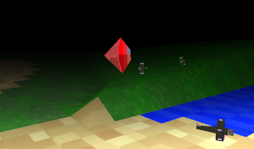

#  terrain

A 3d rust game using OpenGl and Emscripten to build for the wasm32-unknown-emscripten.
It can also run standalone, developed and tested on Linux but will
work on Windows, see some of the other Rust projects in this repo.




I've hosted the WASM version here https://bjason.org/en/wasm/terrain/play-terrain/

to run standalone
```
cargo build
cargo run
```

to package
```
rsync -avz resources target/debug
cd target/debug
zip -r bus-zombie-rust-linux.zip bus-zombie-rust resources
```

For web deployment. You may need to do
```
rustup target add wasm32-unknown-emscripten
```

then this will work
```
cargo build --target=wasm32-unknown-emscripten 
```

To try web version locally having built to emscripten target try script
```
./run_wasm.sh
```

to package
```commandline
cd target/wasm32-unknown-emscripten/debug
zip wasm32-unknown-emscripten.zip terrain.wasm terrain.js terrain.d index.html 
```

on linux to target windows without sound
```
export PKG_CONFIG_ALLOW_CROSS=1
cargo build --target x86_64-pc-windows-gnu --features soundoff
rsync -avz windows/SDL2.dll resources target/x86_64-pc-windows-gnu/debug
cd target/x86_64-pc-windows-gnu/debug
zip -r terrain.zip terrain.exe SDL2.dll resources
```
